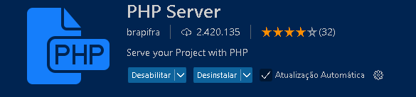

<a href="Readme.md" style="color:#B0E0E6;">Inglês</a> 


# Entrega do curso Tipos de Variáveis em PHP - DIO
Este curso oferece uma introdução à linguagem de programação PHP, cobrindo os conceitos fundamentais que você precisa entender para começar a programar com PHP de forma eficiente. O foco é aprender a trabalhar com variáveis, strings e arrays, que são os pilares essenciais para o desenvolvimento em PHP.
## Tecnologias Utilizadas

- PHP
- HTML


## Como Executar o Projeto

1. Clone o repositório:

   ```bash
   git clone https://github.com/Miguelalmeida01/curso_Tipos_de_Vari-veis_em_PHP-Dio.git
   ```

2. usar o PHP Server para abrir o projeto no chrome:
    ####
     
    ####
3. para rodar no vscode :   

   ```bash
   F5
   ```


<a href="https://github.com/Miguelalmeida01/curso_Tipos_de_Vari-veis_em_PHP-Dio/blob/main/Readme-pt.md#entrega-do-curso-tipos-de-vari%C3%A1veis-em-php---dio" style="color:#B0E0E6">Voltar</a> 
