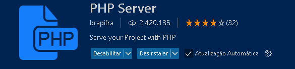

<a href="Readme-pt.md" style="color:#B0E0E6;">Portuguese</a>

# Course Delivery Types of Variables in PHP - DIO
This course offers an introduction to PHP programming language by covering the fundamental concepts you need to understand to start programming with PHP efficiently.The focus is to learn to work with variables, strings and arrays, which are the essential pillars for PHP development.
## Technologies used

- PHP
- HTML


## How to execute the project

1. Clone the repository:

   ```bash
   git clone https://github.com/Miguelalmeida01/curso_Tipos_de_Vari-veis_em_PHP-Dio.git
   ```

2.Use PHP Server to open the project at Chrome:
    
   
    
3. To roll not vscode:   

   ```bash
   F5
   ```


 
<a href="https://github.com/Miguelalmeida01/curso_Tipos_de_Vari-veis_em_PHP-Dio/tree/main#course-delivery-types-of-variables-in-php---dio" >
Back</a> 
